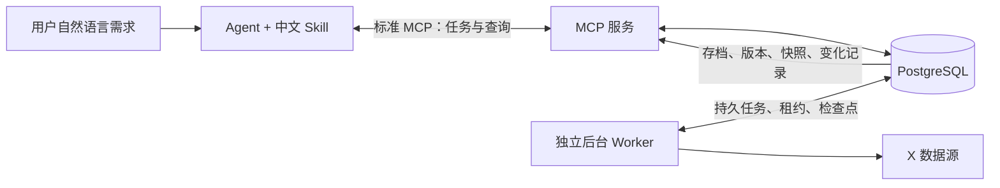

# X-agent-skill

**让 AI Agent 把 X 博主的帖子、评论与互动变化，整理成可持续积累的研究资料。**

[](https://github.com/zhuy3075-ui/X-agent-skill/releases)
[](LICENSE)

X-agent-skill 提供标准 MCP 服务、独立后台采集程序和中文技能，适合创作者研究、
选题资料积累、评论需求分析和少量博主的持续监测。业务数据持久化到 PostgreSQL；
用户用自然语言提出目标，由 Agent 选择工具与参数。

## 解决什么问题

- **收藏了很多高互动帖子，却难以复盘**：保存正文、来源、评论和指标，支持按条件检索与导出。
- **不知道受众真正关心什么**：分析评论趋势、关键词、活跃评论者及需求证据。
- **只能看到当前累计互动，无法观察增长**：持续保存指标快照，按实际观测比较变化。
- **采集失败后不知道拿到了什么**：保留已提交的数据和游标，明确返回进度、缺口与失败原因。
- **不想一直手动刷新或被日报打扰**：后台按小时采集，Agent 仅在用户询问时汇报。

## 已实现能力

| 能力 | 实现方式 |
| --- | --- |
| 参数化博主采集 | 按博主、时间、类型、数量及预算采集，切换目标无需修改代码 |
| 评论分页与增量 | 保存已知分页分支和检查点，支持有界续采；覆盖范围明确可查 |
| 博主档案 | 数字用户 ID 唯一建档，关联帖子、评论、互动快照与操作历史 |
| 内容与状态变化 | 记录新增、正文修改、暂时不可见及恢复；多次缺失仅标记疑似删除 |
| 多账号调用 | 用户配置的有效账号轮换，尊重配额、冷却、锁定及失效状态 |
| 画像与素材研究 | 发布节奏、内容特征、互动表现、评论分析与高互动候选素材证据 |
| 数据检索与导出 | PostgreSQL 索引、游标分页、全文检索，评论支持 CSV／JSONL |
| 标准 MCP | 31 个工具；stdio 与带 Bearer 认证的 Streamable HTTP |

## 架构与职责



Skill 负责理解需求和解释结果；MCP 负责校验、任务和查询接口；Worker 负责调度、采集、
重试和账号配额。两进程在同一台机器运行并共享 PostgreSQL 与导出目录。
Agent 无需常驻，后台不调用模型，也不自动生成或推送报告。

## 环境要求

- Python 3.10 或更新版本，建议 Python 3.12。
- PostgreSQL 14 或更新版本；示例 Docker Compose 使用 PostgreSQL 17。
- 支持 MCP 的 Agent 客户端。
- 访问 X 数据源时需要用户自己的有效 X `auth_token`，网络或代理必须可访问 X。

仓库包含服务所需的 Scweet 运行源码，无需另行安装未修改的 PyPI Scweet。
依赖与上游版权说明见 [NOTICE.md](NOTICE.md)。本项目不是官方 X 产品。

## 快速开始

### 1. 一条命令安装全部组件

```bash
git clone https://github.com/zhuy3075-ui/X-agent-skill.git
cd X-agent-skill
python install.py
```

安装程序创建虚拟环境、安装依赖及 MCP／采集运行包、生成本地配置与 `.env`，
安装一份整合后的 `x-agent-skill`。检测到 Codex CLI 时自动注册 MCP；同名已有配置保持不变。
没有 Codex CLI 时，将生成的 `mcp-client.local.json` 导入支持 stdio 的 MCP 客户端。
安装不创建数据库、不填写 token，也不启动真实监测。

其他客户端可指定 `--skills-dir /path/to/skills --no-register-codex`；不安装技能用 `--skip-skills`。
以下 `python` 应指向安装后的 `.venv/bin/python`（Linux/macOS）或
`.venv/Scripts/python.exe`（Windows）。

### 2. 配置 PostgreSQL

准备数据库及连接权限。已有 PostgreSQL 可以直接使用；本地开发也可设置
`POSTGRES_PASSWORD` 环境变量后执行 `docker compose -f mcp/compose.yaml up -d`。
默认数据库和用户为 `scweet_mcp`／`scweet`，端口为 5432。

在本地 `.env` 或进程环境中设置 `SCWEET_MCP_DATABASE_URL`。`run.py` 读取 `.env`，
不覆盖已有环境变量。推荐将密码保存到受权限保护的 PostgreSQL passfile，
环境变量只保存连接参数，例如：

```text
host=127.0.0.1 port=5432 dbname=scweet_mcp user=scweet passfile=/absolute/path/to/private/pgpass
```

passfile 的行格式为 `host:port:database:user:password`。Linux／macOS 权限设为 `0600`；
Windows 应仅允许当前用户和系统读取。不要提交该文件。
首次初始化使用 schema-owner 连接，运行时改用最低必要权限的服务账号：

```bash
python run.py init-db
```

具体授权、HTTP 认证与同机部署见 [运行说明](mcp/MONITORING.md)。

### 3. 安全配置采集账号

在 `config.json` 中设置 `mcp_credentials_file` 为私有凭据 JSON 的绝对路径。
使用隐藏输入保存 token，不要将 token 作为 MCP 参数、命令行参数或聊天发布内容：

```bash
python mcp/credentials.py --file /absolute/path/to/private/worker-env.json --credential-ref SCWEET_X_ACCOUNT_A
```

可用不同引用重复配置多个账号，例如 `SCWEET_X_ACCOUNT_B`。
凭据文件按请求读取，更新 token 不需要重启 Worker。
Agent 随后通过 `accounts_register` 注册引用，再通过 `accounts_check` 验证。
只有检查成功的有效账号进入采集池。仅查询已存数据不需要 X token。

### 4. 启动独立采集进程

在继承上述数据库环境变量的独立终端运行：

```bash
python run.py worker
```

### 5. 连接 MCP

stdio 客户端示例（替换绝对路径及 passfile 位置）：

```json
{
  "mcpServers": {
    "scweet-monitoring": {
      "command": "/absolute/path/X-agent-skill/.venv/bin/python",
      "args": ["/absolute/path/X-agent-skill/run.py", "mcp", "--config", "/absolute/path/X-agent-skill/config.json"],
      "env": {
        "SCWEET_MCP_DATABASE_URL": "host=127.0.0.1 port=5432 dbname=scweet_mcp user=scweet passfile=/absolute/path/to/private/pgpass"
      }
    }
  }
}
```

Windows 使用 `.venv/Scripts/python.exe`，路径可使用正斜杠。
也可设置至少 32 字符的随机 `SCWEET_MCP_API_TOKEN` 后启动 HTTP：

```bash
python run.py mcp --transport streamable-http
```

默认地址为 `http://127.0.0.1:8765/mcp`，客户端须传 `Authorization: Bearer <API token>`。
这个 API token 与 X 登录 token 是两种不同凭据。对外部署使用 HTTPS。

### 6. 一份整合 Skill

安装器已安装 `mcp/skills/x-agent-skill`。这份技能包含 X／Twitter／推特意图识别、
自然语言参数、采集监测编排和通俗结果表达。其他客户端可将该目录复制到其技能目录。

Codex 默认技能目录为 `~/.codex/skills`。技能不会替你安装数据库或维持后台进程。
升级时保留已安装 `x-agent-skill/config.json` 中的个人偏好，只补充缺失字段。
若已安装旧的 `social-monitoring` 和 `scweet-monitoring-router`，安装器迁移其偏好，
并将旧目录移到技能目录之外的 `skill-backups` 备份，最终只加载一份技能。
不同 MCP 客户端的配置入口不同，以客户端实际工具发现结果为准。

## 可以怎样使用

| 对 Agent 说 | 执行效果 |
| --- | --- |
| “看看 @目标博主 最近在发什么。” | 默认最近 7 天、50 条帖子，不采评论 |
| “分析这个博主的风格，找可参考的选题。” | 默认最近 30 天、100 条原创／引用帖，评论最多覆盖 20 篇 |
| “评论区最关心什么问题？〈帖子链接〉” | 获取或复用可见评论，分析需求并引用代表评论 |
| “把已保存的评论导出成 CSV。” | 导出已存数据，不默认重新采集 |
| “继续采上次没采完的评论。” | 核实任务后从保存的分页分支继续，遵守总预算 |
| “持续监测这个博主的帖子变化，不要推送。” | 明确授权后创建每小时后台监测，询问时再汇报 |
| “他这周改过哪些帖子？互动增长怎样？” | 查询变化历史与快照；没有历史时说明无法还原 |

首次使用由 Agent 自动推断参数。默认值是起步范围，**不是完整采集承诺**。
高互动素材是基于样本的候选证据，不是保证爆款的预测。

## 轻量监测规则

只在用户明确要求持续监测时创建任务，`monitor_upsert` 必须传 `monitoring_requested=true`。
普通画像、一次性采集和历史查询不会自动建立监测。

- 首次回补最近 7 天，建立基线。
- 每小时发现新帖；每轮独立核查最多 5 篇已存帖子，默认核查窗口为最近 30 天。
- 正文、指标和可见性一起观测；旧帖较多时分轮完成，非所有旧帖每小时检查一次。
- 默认不定期采评论、不推送、不生成日报。暂停后在下一请求边界停止后台采集。
- 三次相隔至少一小时的可靠缺失仅标记“疑似删除”；网络、限流或未知响应不作为删除证据。

详见 [轻量调度与变化查询](mcp/HOURLY.md)。

## 工具、数据与结果约定

完整工具说明见 [MCP 接口](mcp/MONITORING.md)、[研究流程](mcp/RESEARCH.md) 和
[机器可读工具 Schema](docs/tools.schema.json)。任务工具返回回执，Agent 通过 `jobs_get`
核实完成情况；查询采用 `records/count/has_more/next_cursor` 结构。

PostgreSQL 保存 JSONB、唯一博主与帖子标识、正文版本、分区快照、任务租约和变化事件。
重复记录按唯一 ID 更新；重复请求用 `request_id` 幂等处理。分页预算耗尽后保留数据与游标。
Agent 最终说明内容条数、时间范围、完整性和原因，默认不向用户展示内部任务 ID 或状态码。

## 验证与维护

```bash
python mcp/server.py --help
python mcp/worker.py --help
python scripts/check_service.py --config config.json
```

检查程序建立新的 stdio 连接，只验证协议、工具发现与数据库查询，不创建采集或监测任务。
发布验证范围与结果见 [VALIDATION.md](docs/VALIDATION.md)。
正式服务器部署模板位于 `mcp/deploy/`；需要按实际目录、服务用户及私有环境文件修改。

## 能力边界与常见问题

- **评论完整性**：仅采集账号可见的评论；隐藏、删除、权限限制和未识别分支会造成缺口。
- **历史增长**：至少需要两次有效观测；当前累计指标不能回填过去增长。
- **删除判定**：查询不到不等于确认删除；平台可见范围变化也可能造成同样现象。
- **数据源变化**：基于 X 私有 GraphQL，接口、签名或登录规则可能变化。
- **限流与账号**：多 token 不代表无限配额；账号失效、需解锁、冷却和预算耗尽均明确反馈。
- **认证缓存**：共享 30 分钟认证缓存属于待实现设计，不是 v1.0.0 已发布能力。
- **部署验证**：不宣称生产容量或平台 SLA，不承诺获取所有评论或永久稳定运行。

## License

MIT。保留上游 Scweet 版权；详见 [LICENSE](LICENSE) 与 [NOTICE.md](NOTICE.md)。
