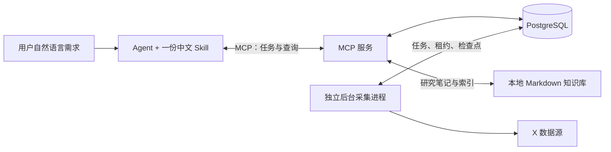

# X-agent-skill

**用自然语言采集 X 博主的帖子与可见评论，积累选题资料、分析内容风格并观察互动变化。**

[](https://github.com/zhuy3075-ui/X-agent-skill/releases/latest)
[](LICENSE)

正式分发包含标准 MCP 服务、独立后台采集程序和一份中文 `x-agent-skill`，以及所需的
Scweet 运行源码。业务数据存储在 PostgreSQL，不需要另外寻找采集器或安装 PyPI Scweet。

## 可以做什么

- 采集指定博主、时间范围和类型的帖子，保存原文、来源和互动指标。
- 获取可见评论，保存分页进度，支持增量获取、继续采集和 CSV／JSONL 导出。
- 按数字用户 ID 建立唯一档案，分类检索帖子、评论、互动快照和操作记录。
- 分析发布节奏、内容风格、评论需求和高互动素材，结论附带样本范围与证据。
- 使用用户配置的多个有效账号，在失效、限流或冷却时进行有界故障切换。
- 明确创建监测后每小时采集，记录新帖、内容修改及可见性变化；用户询问时才汇报。
- 将正文素材、评论需求与资源组合成发布方案，按博主／日期／主题保存到 Markdown 知识库。



Skill 负责理解需求、自动设置参数与解释结果；MCP 校验参数、提交任务和查询数据；
Worker 访问 X、执行队列、调度监测及管理账号配额。MCP 与 Worker 部署在同一台机器，
共享数据库和导出目录。Agent 编写研究内容，由 MCP 保存到知识库；Worker 不写分析报告。
Agent 不必常驻，后台不调用模型、不主动推送日报。

## 安装前准备

需要 Git、Python 3.10+（建议 3.12）、PostgreSQL 14+ 和支持 MCP 的 Agent 客户端。
查询已存数据无需 X 登录凭据；实际采集需要你自己的有效 X `auth_token` 和可访问 X 的网络。
本项目不是 X 官方产品。服务器部署见 [部署指南](docs/DEPLOYMENT.md)。

## 本机安装与启动

### 1. 获取正式版本并安装

```bash
git clone --branch v1.1.0 https://github.com/zhuy3075-ui/X-agent-skill.git
cd X-agent-skill
python install.py
```

Windows 若 `python` 未指向受支持版本，可使用 `py -3.12 install.py`；
Linux／macOS 可使用 `python3 install.py`。也可在 [Release](https://github.com/zhuy3075-ui/X-agent-skill/releases/latest)
下载源码 ZIP，解压后在项目根目录执行安装命令。

安装器会创建 `.venv`、安装全部运行依赖、生成 `.env`、`config.json` 和
`mcp-client.local.json`，并安装一份技能。检测到 Codex CLI 时注册 `scweet-monitoring`；
同名已有注册会保留。没有 Codex CLI 时，使用生成的 JSON 配置连接自己的 MCP 客户端。
数据库、X token 和后台进程仍需按下面步骤配置。

| 需要的安装方式 | 命令 |
| --- | --- |
| 默认安装 MCP、采集器和技能 | `python install.py` |
| 指定其他客户端的技能目录 | `python install.py --skills-dir /absolute/skills --no-register-codex` |
| 只安装服务与采集器 | `python install.py --skip-skills --no-register-codex` |

后续命令使用安装后的 Python：Windows 为 `.venv/Scripts/python.exe`，
Linux／macOS 为 `.venv/bin/python`。为便于直接复制，下面分别提供命令。

### 2. 创建 PostgreSQL 数据库

已有数据库可以直接使用；没有时可用本机 PostgreSQL 或 Docker。
Docker 方式可在安装 Docker 后使用以下命令，密码通过隐藏输入设置：

```powershell
# Windows PowerShell
$databaseSecret = Read-Host 'PostgreSQL password' -AsSecureString
$env:POSTGRES_PASSWORD = [System.Net.NetworkCredential]::new('', $databaseSecret).Password
docker compose -f mcp/compose.yaml up -d
Remove-Item Env:POSTGRES_PASSWORD
```

```bash
# Linux / macOS 的 Bash
read -rsp 'PostgreSQL password: ' POSTGRES_PASSWORD; printf '\n'
export POSTGRES_PASSWORD
docker compose -f mcp/compose.yaml up -d
unset POSTGRES_PASSWORD
```

数据库为 `scweet_mcp`，用户为 `scweet`，
默认仅监听本机 5432；修改 `POSTGRES_PORT` 可避开端口冲突。Docker 不是必需依赖。

打开安装器生成的 `.env`，设置数据库连接。下面只是格式示例，路径须改成你的实际绝对路径：

```dotenv
SCWEET_MCP_DATABASE_URL=host=127.0.0.1 port=5432 dbname=scweet_mcp user=scweet passfile=C:/path/X-agent-skill/private/pgpass
```

在 `private/pgpass` 中填写 `127.0.0.1:5432:scweet_mcp:scweet:<数据库密码>`。
Linux／macOS 使用自己的绝对路径，并执行 `chmod 600 private/pgpass`；
Windows 限制该文件仅当前用户和系统可读。密码含 `:` 或 `\` 时按
[PostgreSQL passfile 规则](https://www.postgresql.org/docs/current/libpq-pgpass.html)转义。
密码文件和 `.env` 均不应上传到仓库。

初始化数据表和索引：

```powershell
# Windows，在项目根目录执行
.venv/Scripts/python.exe run.py init-db
```

```bash
# Linux / macOS，在项目根目录执行
.venv/bin/python run.py init-db
```

本机专用开发数据库可使用其 owner 初始化与运行；正式服务器应分离 owner 和运行角色，
具体创建与授权步骤见 [部署指南](docs/DEPLOYMENT.md#2-数据库角色与初始化)。

### 3. 从浏览器获取 X auth_token

仅获取你本人或明确授权使用的账号的登录 Cookie。以下以 Chrome／Edge 为例：

1. 打开 [X](https://x.com/home)，登录目标采集账号，确认能正常查看首页。
2. 按 `F12` 或 `Ctrl+Shift+I` 打开开发者工具；macOS 使用 `Cmd+Option+I`。
3. 切换到 **Application（应用）→ Storage（存储）→ Cookies**。
   若未显示 Application，使用顶部 `»` 展开更多面板。
4. 选择当前 X 页面的 Cookie 来源，通常显示为 `https://x.com`；确认 Domain 属于 `x.com`。
5. 在筛选框输入 **`auth_token`**，选中对应 Cookie，复制其 **Value（值）**。
   只复制值，不带 `auth_token=`、引号、分号，也不要复制整条 Cookie 请求头。
6. 按下一节通过隐藏输入保存，完成后清空剪贴板。不要把值发给 Agent 聊天、贴进 issue 或截图。

Cookies 面板和 Value 字段的操作可参考 [Chrome 官方说明](https://developer.chrome.com/docs/devtools/application/cookies)。
`auth_token` 是网页登录凭据，不是 X 开发者 API 的 Bearer Token，也不是本服务的 MCP API token。
如果找不到该 Cookie，确认已登录、选中了正确来源，再刷新首页；不要用 `ct0` 等其他 Cookie 代替。
浏览器能显示 Cookie 不代表它仍然有效，后续必须完成账号检查。

### 4. 保存并注册账号

安装器已将 `config.json` 的 `mcp_credentials_file` 指向本机 `private/worker-env.json`。
在项目根目录执行，终端出现 `X auth token:` 后粘贴 Cookie 值并回车；输入不会显示：

```powershell
# Windows
.venv/Scripts/python.exe mcp/credentials.py --file private/worker-env.json --credential-ref SCWEET_X_ACCOUNT_A
```

```bash
# Linux / macOS
.venv/bin/python mcp/credentials.py --file private/worker-env.json --credential-ref SCWEET_X_ACCOUNT_A
```

多个账号分别使用 `SCWEET_X_ACCOUNT_A`、`SCWEET_X_ACCOUNT_B` 等不同引用；重复运行会保留其他条目。
如果你修改了 `mcp_credentials_file`，`--file` 必须指向同一个文件。
凭据文件按请求读取，替换 token 不必重启 Worker，但需重新核验账号身份。

### 5. 启动采集器、连接 MCP

单独打开一个终端，进入项目根目录并保持 Worker 运行：

```powershell
# Windows
.venv/Scripts/python.exe run.py worker
```

```bash
# Linux / macOS
.venv/bin/python run.py worker
```

stdio 模式由 MCP 客户端启动服务，不需要手动再开一个 MCP 终端。
把生成的 `mcp-client.local.json` 中 `mcpServers.scweet-monitoring` 配置导入客户端；
部分客户端要求手工填写 command 和 args，沿用 JSON 中的绝对路径即可。例：

```json
{
  "mcpServers": {
    "scweet-monitoring": {
      "command": "C:/path/X-agent-skill/.venv/Scripts/python.exe",
      "args": ["C:/path/X-agent-skill/run.py", "mcp", "--config", "C:/path/X-agent-skill/config.json"]
    }
  }
}
```

`run.py` 自动读取仓库 `.env`，进程环境中的同名设置优先。
Linux／macOS 把 command 改为对应绝对路径的 `.venv/bin/python`。
客户端如果保留旧注册，手动更新 command／args 到当前安装位置，重新连接后检查工具列表。

连接成功后对 Agent 说：

> 注册我已配置的 SCWEET_X_ACCOUNT_A，检查登录状态；检查完成前不要开始采集。

Agent 应调用 `accounts_register`，随后 `accounts_check`，通过 `jobs_get` 核实完成结果。
Worker 未启动时检查任务会排队；只有检查成功的有效账号可用于采集。
注册工具的结构为 `entries=[{credential_ref,label}]`，**只传引用，不传 token 原文**。

最后执行只读健康检查，正常应返回 `healthy=true`、`tools=35`、`database_read=true`：

```powershell
# Windows
.venv/Scripts/python.exe scripts/check_service.py --config config.json
```

```bash
# Linux / macOS
.venv/bin/python scripts/check_service.py --config config.json
```

此检查确认 stdio 协议和数据库查询，不证明 X 登录有效，也不创建采集或监测。

## Skill 的安装与使用

安装器默认放到 `CODEX_HOME/skills`，未设置时为 `~/.codex/skills`。
其他客户端可指定 `--skills-dir` 或复制 `mcp/skills/x-agent-skill` 到其支持的技能目录。
只有这一份技能，包含平台意图识别、参数推断、分页、档案、分析及通俗结果表达。
升级保留个人 `config.json`；旧 `social-monitoring`／`scweet-monitoring-router` 会迁移偏好并备份到
加载目录外。刷新客户端技能列表后可显式使用 `$x-agent-skill`。

| 可以这样提问 | 执行效果 |
| --- | --- |
| “看看 @目标博主 最近在发什么。” | 默认最近 7 天、50 条帖子，不采评论 |
| “分析他的内容风格，给我可参考的选题。” | 默认最近 30 天、100 条原创／引用帖，评论最多覆盖 20 篇 |
| “评论区最关心什么？〈帖子链接〉” | 获取或复用可见评论，分析需求并引用证据 |
| “把已采到的评论导出 CSV。” | 导出已有数据，不默认重新采集 |
| “继续采上次没采完的评论。” | 核实真实进度，沿保存的分页分支继续 |
| “持续监测他的帖子变化，不要推送。” | 明确授权后创建每小时监测，询问时汇报 |
| “他这周改过哪些帖子，互动增长怎样？” | 查询实际变化记录与快照，没有历史就说明缺口 |

用户无需手动填写所有参数，Agent 自动推断起步范围；默认值不是完整采集承诺。
高互动素材属于基于样本的候选证据，不保证产生爆款。

## Markdown 研究知识库与发布组合

将每篇帖子拆解成可借鉴内容，再把正文素材、评论痛点与可用资源组合为发布方案。
知识库按博主、日期、主题和笔记类型建立索引，含帖子分析、每日清单、素材、需求、资源、组合与决策报告。
稳定 ID 避免重复保存；更新需核对内容指纹，旧版本保留。没有评论证据的组合标为待验证。

本机安装默认在项目根目录创建 `精致清单/`，包含目录与通用模板，没有实际博主报告。
`mcp_knowledge_base_dir` 可指定其他绝对路径；真实笔记和个人配置不提交 Git。
MCP 提供 save_research_note／get_research_note／query_research_notes／rebuild_research_index，
由用户要求时的 Agent 生成、保存和复用分析；后台不自动编写日报或发布内容。
详细路径、元数据、模板和使用方法见 [知识库说明](docs/KNOWLEDGE_LIBRARY.md)。

## 调度与数据约定

一次采集、画像或历史查询不自动创建持续监测。只有明确监测意图才允许
`monitor_upsert(monitoring_requested=true)`：首次回补最近 7 天，每小时发现新帖，
每轮最多核查 5 篇已存帖子，默认覆盖最近 30 天，分轮观察正文、指标和可见性。
默认不定期采评论、不推送报告。三次至少间隔一小时的可靠缺失仅标记疑似删除；
网络失败、限流和未知响应不作为删除证据。恢复可见时保留此前存档和历史。

数据按唯一 ID 更新，任务按 request_id 幂等提交；PostgreSQL 保存 JSONB、索引、正文版本、
快照、档案和队列。既有 Scweet 账号／接口清单缓存可使用 SQLite，采集业务数据始终在 PostgreSQL。
35 个工具的参数与返回值见 [工具 Schema](docs/tools.schema.json)，以连接后 `tools/list` 为准。
Agent 核实任务结果后说明条数、日期、完整性及原因，默认隐藏内部任务 ID 和状态码。

## 正式服务器部署、升级与排障

使用 [部署指南](docs/DEPLOYMENT.md)完成 Linux 同机 PostgreSQL／API／Worker 部署、
systemd 托管、HTTPS、权限、备份和版本升级；部署模板在 `mcp/deploy/`。
安装器不自动开通服务器、修改防火墙或迁移数据库。Windows 本机按上面的独立终端流程运行即可。

| 现象 | 排查与处理 |
| --- | --- |
| 数据库连接失败 | 检查 .env、端口、数据库名、用户、passfile 路径和文件权限 |
| 数据表／版本不可用 | 使用 schema-owner 执行 init-db，再给运行角色授权 |
| 任务一直等待 | 检查独立 Worker 是否运行，且与 MCP 使用同一数据库和配置 |
| 登录失效／需要验证 | 在浏览器完成登录或账号解锁，更新 token 并重新 accounts_check |
| 可见评论未采完整 | 查看停止原因，按已有任务继续；不要反复从第一页重新提交 |
| 只有一次指标记录 | 暂不能判断增长，后续积累真实快照 |
| HTTP 提示未认证 | 检查 Authorization Bearer 与 SCWEET_MCP_API_TOKEN，一般不是 X token 问题 |

平台私有 GraphQL 可能变化。隐藏、删除、受保护内容不保证取得；疑似删除不等于确认删除。
跨任务共享的 30 分钟认证缓存尚不支持；评论词频和词典情感统计有语义局限。

## License

MIT。保留上游 Scweet 版权，详见 [LICENSE](LICENSE) 和 [NOTICE.md](NOTICE.md)。
