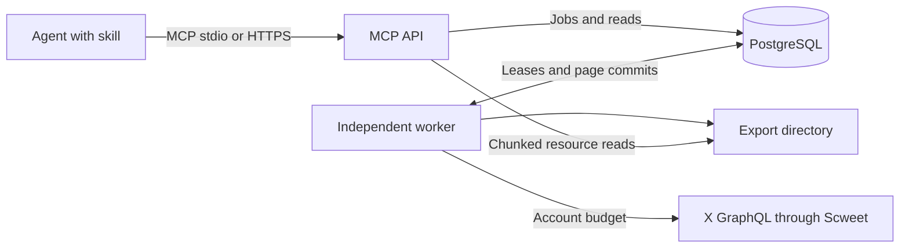

# Social monitoring: local development and server operation

The service has three parts. The portable [skill](skills/x-agent-skill/SKILL.md) selects
tools and writes reports. `server.py` exposes 31 MCP tools and export resources. `worker.py`
is an independent process that collects data, schedules jobs and analyzes records. Push delivery is disabled.
Both processes use one PostgreSQL database and one export directory on the same computer.
The API process does not need X credentials. Closing an agent does not stop the worker.

For a one-time parameterized collection, dynamic token replacement, author profiles, saved
candidate materials and growth queries, start with [RESEARCH.md](RESEARCH.md).



## Run on Windows

Install Python 3.10+ and PostgreSQL 14+ (17 is used for the local test setup). Use a virtual
environment. From the repository root:

```powershell
python install.py
```

Create a development database in PostgreSQL, or use `docker compose -f mcp/compose.yaml up -d`
after setting `POSTGRES_PASSWORD`. Docker is optional. A native PostgreSQL service also works.
Set these environment values with your local secret store or the process launch configuration:

| Process | Required environment | Use |
| --- | --- | --- |
| API and worker | `SCWEET_MCP_DATABASE_URL` | PostgreSQL DSN; same database |
| HTTP API only | `SCWEET_MCP_API_TOKEN` | Random secret of at least 32 characters for agent authentication |
| Worker only | `SCWEET_X_ACCOUNT_A`, `SCWEET_X_ACCOUNT_B`, etc. | X auth token values; names must start with `SCWEET_X_` |
| Worker, optional | `SCWEET_PROXY_ACCOUNT_A`, etc. | Proxy URL values; references start with `SCWEET_PROXY_` |
| Worker, optional | A webhook `secret_ref` | HMAC secret for its configured destination |

Do not put secrets in the JSON config, source files, MCP arguments or chat. Config files do not
load `.env` files directly. The distribution run.py loads .env without overriding process values.
Direct entry points must receive their environment when they start. Alternatively,
set `mcp_credentials_file` to a restricted JSON credential file: the worker reads it for each
request, so token replacement does not require a restart. Each `collect_author` job checks the
selected account before use; a changed identity between requests stops collection.

With a schema-owner DSN, initialize the additive schema. This preserves the existing tweet table.
No production database is changed by installation:

```powershell
.venv/Scripts/python.exe mcp/server.py --config mcp/config.local.example.json --init-db
```

In terminal 1, start the worker with its environment:

```powershell
.venv/Scripts/python.exe mcp/worker.py --config mcp/config.local.example.json
```

In terminal 2, start the API with its environment:

```powershell
.venv/Scripts/python.exe mcp/server.py --config mcp/config.local.example.json --transport streamable-http
```

Connect a Streamable HTTP MCP client to `http://127.0.0.1:8765/mcp`, with
`Authorization: Bearer <the API secret>`. Use the client's secure header configuration. This is
a preconfigured bearer deployment, not an OAuth authorization server. Clients that require
automatic OAuth discovery need an authentication gateway. The SDK negotiates MCP protocol versions.

For stdio, let the agent start `python mcp/server.py --config <absolute-config-path>` instead.
Only the worker needs to remain in a separate terminal. Use absolute interpreter and script paths
in the agent configuration. API logs use stderr. Worker logs contain job IDs and safe error codes.
Relative artifact and manifest paths resolve from the checkout root, independent of the launch directory.

Then call these tools through the connected agent:

1. `accounts_register(entries=[{credential_ref:"SCWEET_X_ACCOUNT_A",label:"primary"}], request_id="register-a-1")`.
2. `accounts_check(account_ids=[returned ID], level="login", request_id="check-a-1")`.
3. Poll `jobs_get`; read `accounts_list`. A valid home-page check does not prove all endpoints work.
4. `monitor_upsert(config={author_id:"numeric-X-user-ID",timezone:"Asia/Shanghai"}, request_id="monitor-1", monitoring_requested=true)`.
5. Use `monitor_run_now`, `jobs_get`, `query_tweets` and `query_metric_snapshots` to inspect the result.

The default account limits are inherited from Scweet: 300 GraphQL requests and 6,000 returned
records per rolling 24 hours, with 50 requests per 900 seconds and a minimum request gap.
The last response can exceed a record target. Account checks and signature bootstrap also make
home-page requests; they are not GraphQL quota entries. Duplicate references to one verified X
identity are ineligible. The worker checks enabled accounts serially each hour by default.
Uncertain network failures get a short cooldown; a 404 is not proof of invalid credentials.
Set `manifest_scrape_on_init=true` to refresh request metadata through an authenticated X session
with the configured cache TTL, or use `manifest_url` and `manifest_update_on_init` for a maintained
manifest source. A failed strict refresh stops that request; it does not invalidate the account.

## Tools and result contracts

`tools/list` supplies input and output JSON Schema. IDs are strings. Service entity IDs are UUIDs;
X IDs are numeric strings. Times use ISO 8601 with a zone and are stored as UTC. Time ranges are
start-inclusive and end-exclusive. Unless stated otherwise, `limit=50` (1..100) and `cursor=null`.
Keep filters unchanged when following a cursor. Invalid tools return MCP `isError=true`; queued
work errors appear in `jobs_get.error`. A request ID identifies exactly one set of arguments.

Common shapes:

```text
Page = {records: object[], count: int, has_more: bool, next_cursor: string|null}
JobReceipt = {job_id: UUID, status: string, submitted_at: time}
Job = {job_id, kind, status, submitted_at, started_at?, finished_at?,
       progress:{pages,fetched,inserted,updated}, result:object|null,
       error:{code,message,retryable}|null, attempts:int, cancel_requested:bool}
Coverage = {scope, status, fetched_unique?, platform_reported_count:null,
            pending_branches:int, stop_reason:string, checked_at:time, source?}
MonitorResult = {monitor_id,version,enabled,next_run_at,estimated_requests_per_day:null,warnings:[]}
Comment = {comment_id,root_post_id,parent_comment_id,author:{id,handle,display_name},
           text,published_at,first_seen_at,last_observed_at,likes,reply_count,availability,raw}
Snapshot = {snapshot_id,post_id,observed_at,scheduled_at,metrics,missing_fields,source,collection_run_id,quality}
```

Job terminal states are `succeeded`, `partial`, `failed` and `cancelled`. `queued` and `running`
are not terminal. Coverage is `unknown`, `partial` or `exhausted_visible`. The last means visible
recognized cursors ended, never that hidden or deleted platform records were included.
`fetched_unique` describes the current job, not all historical comments in storage.

| Tool | Purpose and input | Return |
| --- | --- | --- |
| `write_tweets` | Atomic JSON write; `records` (1..configured batch limit), each with `tweet_id` | `{received,stored}`; full replacement by ID |
| `get_tweet` | `tweet_id` | `{found,record}` |
| `query_tweets` | Optional `author` handle, `lang`, `since`, `until`, `limit`, `cursor` | `Page` of complete JSON |
| `search_tweets` | Required literal token phrase `text`; same filters as query | `Page` of complete JSON |
| `monitor_upsert` | `config`, `request_id`, `monitoring_requested=true`; updates also need `monitor_id`, `expected_version` | `MonitorResult` |
| `monitors_list` | Optional `author_id`, `enabled`, `limit`, `cursor` | `Page`; rows include `id`, config, version, watermark, scheduling times, last error, lag seconds |
| `monitor_set_state` | `monitor_id`, `enabled`, `expected_version` | `MonitorResult`; use jobs_cancel to cancel an already running job |
| `monitor_run_now` | `monitor_id`, `request_id` | `JobReceipt`; paused monitors do no collection |
| `refresh_post_metrics` | `post_ids` (1..100), `request_id` | `JobReceipt`; result has progress, missing IDs and source |
| `query_metric_snapshots` | `post_id`; optional `since`, `until`, `metrics`, `limit`, `cursor` | `Page` of snapshots, newest first |
| `sync_comments` | `post_id`, `request_id`; `mode=incremental` (`full`,`incremental`,`reconcile`), `scope=thread` (`direct`,`thread`), `max_pages=100`, `max_runtime_seconds=300` | `JobReceipt`; result has progress, coverage and source |
| `query_comments` | `post_id`; `scope=thread`; optional `parent_comment_id`, `published_since`, `first_seen_since`, `author_id`, `limit`, `cursor` | `Page` of comments plus `coverage`; first-seen order |
| `export_comments` | `post_id`, `request_id`; `scope=thread`, `format=jsonl` (`csv`,`jsonl`), `fields=null`, `require_complete=true` | `JobReceipt`; export manifest in result |
| `analyze_comments` | `post_id`, `request_id`; optional `since`, `until`; `bucket=day` (`hour`,`day`), `timezone=UTC`, `top_k=20` (1..100), `include_sentiment=false` | `JobReceipt`; descriptive analysis in result |
| `analyze_author` | `author_id`, `since`, `until`, `request_id`; `timezone=UTC`, `post_types=null`, `sample_limit=10000`, `include_comments=true` | `JobReceipt`; style statistics and comment evidence in result |
| `accounts_register` | `entries` (1..100): `{credential_ref,label,proxy_ref?}`, `request_id` | `{accounts:[{account_id,credential_ref,health}]}` |
| `accounts_list` | Optional `status`, `limit`, `cursor` | `Page` of safe account references, identity, health, cooldown, capabilities and enabled state |
| `accounts_check` | `account_ids` (1..100), `request_id`; `level=login` (`login`,`capability`), optional `capabilities` (`timeline`,`lookup`,`comments`) | `JobReceipt`; `{accounts:[{account_id,health,capabilities}]}` in result |
| `accounts_set_state` | `account_ids`, `enabled`; optional `reason` (not stored) | `{account_ids,enabled}` |
| `jobs_get` | `job_id` | `Job` |
| `jobs_cancel` | `job_id` | `{job_id,status,cancellation_requested}`; keeps committed pages |
| `events_query` | `consumer_ref`; optional `types` (`new_post`,`metric_change`,`content_changed`,`availability_changed`), `limit`, `cursor` | `Page` of `{event_id,type,monitor_id,post_id,observed_at,payload}` |
| `events_ack` | `consumer_ref`, `event_ids` (1..100) | `{acknowledged_ids,already_acknowledged_ids}` |

`MonitorConfig` requires `author_id`. Defaults: enabled, UTC, discovery every 3600 seconds,
7 days of initial history, post types `original,quote`, metrics `likes,comments,reposts,views`.
`metric_schedule` is an increasing list of `{max_post_age_hours,interval_seconds}`; defaults are
720/3600. Posts older than the last age stop metric refresh. Set
`comments_interval_seconds` (minimum 3600) to enable comment scans. `destination_refs` must be [].
`monitor_upsert` requires `monitoring_requested=true`, derived from an explicit user request.
`lookup_posts_per_run=5` bounds hourly round-robin checks. `report_mode=on_demand` disables push.
See [hourly monitoring](HOURLY.md) for schema 3, visibility rules and `query_post_changes`.
`alerts={new_posts:true,rules:[]}`. A rule has `metric`, `window_seconds` (minimum 60),
`min_delta` (minimum 1), optional `min_ratio`, `direction=increase` or `decrease`, and
`cooldown_seconds=3600`. A usable baseline must lie between one and two windows before the current
observation. With a zero baseline, only the absolute threshold applies. Missing metrics stay null.
No request-cost estimate is invented: the returned estimate is null and a warning explains why.

Full/reconcile comment jobs start at the first page; incremental jobs first continue a previous
partial traversal and otherwise revisit from the first page. All modes upsert IDs. A reconcile
does not mark missing comments deleted, because source omission is not proof of deletion.
Budgets cap each job, and periodic runs continue partial traversal. Direct replies filter by parent;
thread replies filter by root conversation ID. Unknown or repeated cursors force partial coverage.

Export fields: `comment_id,root_post_id,parent_comment_id,author_id,author_handle,author_name,text,
published_at,first_seen_at,last_observed_at,likes,reply_count,availability`. A null field list selects
all fields. CSV formula prefixes are escaped. JSONL keeps text values unchanged. The result contains
`artifact_id,resource_uri,format,fields,row_count,byte_count,sha256,coverage,created_at,csv_formula_escaped`.
Read `scweet://exports/{artifact_id}/{offset}`. The resource returns `{manifest,offset,encoding:"base64",
content,next_uri}`. Decode and concatenate bytes. The API and worker must use the same artifact path.

Analysis contains `analysis_version,population_count,sample_count,sampling,timezone,coverage,trend,
trend_basis,keywords,tokenizer,active_authors,sentiment,style,evidence,limitations`.
Author reports can add `comment_demand`. The record cap is 10,000 by default; the SQL sample is
time-stratified. Trend counts describe the sample's publish times, not discovery times or a scaled
population estimate. Text features and cadence are deterministic. English words and Chinese
character bigrams are keywords. Lexical sentiment is optional and explicitly limited. The skill
performs semantic interpretation and cites evidence. Comments for author demand use a bounded latest
sample; the report labels that choice. These tools read stored data and do not silently collect more.

## Storage and failure behavior

`sm_posts` and `sm_comments` hold current JSONB plus indexed ID, author, root and time columns.
`sm_versions` keeps distinct content hashes. `sm_snapshots` appends typed metric columns and JSONB
with observation time, scheduled time, source and missing-field metadata. Old observations cannot
replace a newer current record. `sm_observations` provides retry deduplication independent of partitions.
Each collected page, checkpoint and event commits in one transaction under a valid job lease.

`sm_jobs` persists idempotency keys, budgets, checkpoints, attempts and leases. PostgreSQL row locks
with `SKIP LOCKED` coordinate workers. Heartbeats extend live leases. A stale worker cannot commit.
There are five source attempts by default with exponential backoff; retry state survives restart.
Account cooldown waits do not spend source attempts and stop after a bounded waiting period. Cancellation takes effect at
request/page or export chunk boundaries. Long source calls must finish their timeout first.
`sm_monitors` stores configuration and schedules. `sm_accounts` stores references, health and quota
metadata. No auth tokens are copied to PostgreSQL or to the existing GUI account database.
The SQLite manifest file is a request-metadata cache, not collected data or account storage.

The snapshot table has monthly range partitions for the current and next three months at schema
initialization, plus a default partition. Re-run initialization with the schema-owner role before
future months arrive. If a default partition already holds rows in a target month, initialization
leaves them there; moving existing data requires an operator migration window. No automatic data
deletion or retention policy runs. Schedule backups and partition maintenance outside the agent.

Keep pagination queries bounded. Analysis population counts and time-stratified sampling can scan
the selected range and are subject to the configured statement timeout. Large ranges may need
narrower windows or future precomputed aggregates. Do not claim an unmeasured production capacity.
The database opens bounded per-operation connections. PgBouncer can be added after measuring load.

Changes are durable, queryable events. The agent reads them only when the user asks. Use
`query_post_changes` for repeatable post history; it does not depend on event acknowledgments.
The default worker does not deliver webhooks (`mcp_notifications_enabled=false`), and on-demand
monitors reject nonempty destination_refs. No periodic report or proactive agent task is created.
The legacy signed webhook transport remains for integrations with already queued deliveries,
but it is outside this mode. Existing destinations do not override the no-push monitor contract.

## Move to one server

Copy the repository and install the same dependencies in a Linux virtual environment. Copy
`config.server.example.json` to `/etc/scweet/config.json`. Use absolute artifact and manifest paths.
Create the `scweet` service user, a private `/var/lib/scweet-mcp` directory, and PostgreSQL roles.
Use the schema-owner role only for `--init-db`. For a dedicated service database, a runtime role needs:

```sql
GRANT CONNECT ON DATABASE scweet_mcp TO scweet_runtime;
GRANT USAGE ON SCHEMA public TO scweet_runtime;
GRANT SELECT, INSERT, UPDATE ON ALL TABLES IN SCHEMA public TO scweet_runtime;
GRANT USAGE, SELECT ON ALL SEQUENCES IN SCHEMA public TO scweet_runtime;
```

These grants assume a database dedicated to this service. Do not grant access to unrelated tables
in a shared database. Grant new partitions to the runtime role or set schema-owner default privileges.
Keep a tested database backup and a matching export-directory backup. Retain the existing data table;
the monitoring schema is additive. Secret environment references must be reconfigured on the server.

Place API variables in `/etc/scweet/api.env` and worker variables in `/etc/scweet/worker.env` with
restricted permissions. Use the two `deploy/*.service` examples with systemd. Both processes run
on the same server. Use `deploy/nginx.conf.example` with your domain and TLS certificate; expose only
HTTPS, keep PostgreSQL and port 8765 on loopback, and preserve the bearer header. This example is for
configured agent clients, not browser-origin access. It has no tenant separation: connect trusted agents.
Review templates before installation. This repository does not deploy or enable services automatically.

For local stopping, use Ctrl+C. For server stopping, stop the two service units. In-flight jobs keep
committed pages and can resume after lease expiry. Do not delete the database volume during upgrades.

## Validation

From the distribution root, use its virtual environment:

```powershell
python scripts/check_service.py --config config.json
```

This read-only check discovers tools through a new stdio session and queries PostgreSQL. It does not
collect from X. The upstream development test suite and captured records are not part of this release.
Release verification and its limits are documented in docs/VALIDATION.md at the distribution root.
If you supply captured fixtures for development, use a separate disposable `_test` database. Fixture
mode must not access X or mark a token valid. Live X access and server templates need target-host
acceptance; local protocol checks do not establish production capacity.

Protocol and partition references: [MCP transport specification](https://modelcontextprotocol.io/specification/2025-11-25/basic/transports)
and [PostgreSQL partitioning](https://www.postgresql.org/docs/current/ddl-partitioning.html).


## Comment recovery, pagination and author archives

See [RECOVERY.md](RECOVERY.md) for the measured failure diagnosis, account-pool setup and retry settings.
Schema version 2 adds author identity, post ownership and operation links without moving existing data.
Run `server.py --init-db` as the schema owner, grant runtime access to new tables, then restart API/worker.
The guarded migration links historical records once. Test migration duration on a copy before large-server use.

The service exposes 31 tools. The four archive additions below use the same MCP result/error conventions;
`query_post_changes` is documented in [hourly monitoring](HOURLY.md).

| Tool | Input | Output |
| --- | --- | --- |
| `continue_comments` | `job_id`, `request_id`, `max_pages=100`, `max_runtime_seconds=300` | `JobReceipt`; inherits post, scope and pending/visited cursors into one new bounded batch |
| `query_author_archives` | Optional `author_id`, `handle`, `limit=50`, `cursor` | `Page` of `{archive_version:1,author_id,handle,created_at,updated_at}` |
| `query_author_history` | `author_id`, optional `limit`, `cursor` | `Page` of operation, job ID, created/finished times, status, progress and safe error |
| `query_author_data` | `author_id`, `category=posts/comments/interactions`, optional `limit`, `cursor` | `Page` of `record_id`, `observed_at` and category payload/metrics |

Archive keys are numeric X user IDs. Handles may change or be reassigned. Collected categories keep their
existing tables; comments link through the root-post owner, not the commenter. Archive history records
submitted operations, not every read query. Unknown legacy ownership remains unassigned until verified.
Retrying a job does not add another operation. A continuation is a distinct linked operation.

The worker preserves Bottom and ShowMoreThreads cursors, visits all known branches and commits checkpoints
with the page data. A terminal partial/failed/cancelled comment job can be continued explicitly. Do not
resume a running job, repeat a parent with an existing child, or invent a cursor after NO_CONTINUATION.
A known empty page with a continuation is not the end. Only an exhausted queue with no unknown/repeated
pagination gives exhausted_visible. This never promises access to hidden, deleted or protected comments.
The skill traverses each requested author's post list and chains bounded batches within its total budget.
